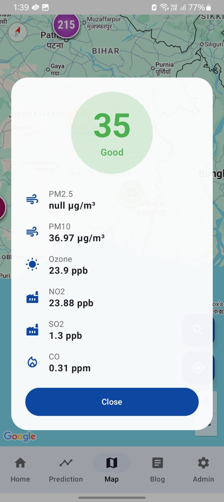
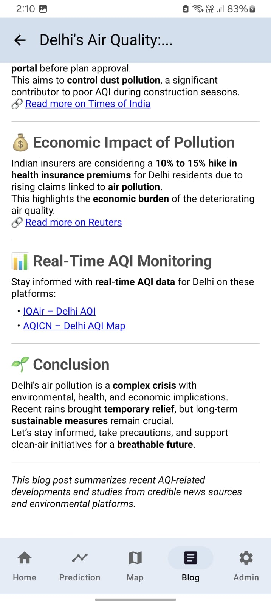

# Air Quality Monitoring and Management System 🌍

## 📋 Table of Contents
- [Overview](#overview)
- [Project Preview](#project-preview)
- [Key Features](#key-features)
- [Technical Architecture](#technical-architecture)
- [Machine Learning Implementation](#machine-learning-implementation)
- [Real-time Data Management](#real-time-data-management)
- [Role-Based Access Control](#role-based-access-control)
- [Technologies Used](#technologies-used)
- [Complex Problem Solutions](#complex-problem-solutions)

## 🌟 Overview

A comprehensive Air Quality Monitoring and Management System that provides real-time AQI (Air Quality Index) updates, predictive analytics, and hierarchical management of air quality sensors across different locations. The system integrates advanced technologies to deliver accurate, real-time air quality information while maintaining efficient management of sensor networks.

## 📸 App Screenshots

---

### 🏠 Home Screen Preview (Real-time AQI & Trends)

<table>
  <tr>
    <td align="center">
       
      <b>Real-time AQI</b>
    </td>
    <td align="center">
       
      <b>Trends & Calendar</b>
    </td>
  </tr>
</table>

---

### 📈 Prediction Screen

<table>
  <tr>
    <td align="center">
       
      <b>Prediction View 1</b>
    </td>
    <td align="center">
       
      <b>Prediction View 2</b>
    </td>
  </tr>
</table>

---

### 🌍 Live AQI Map

<table>
  <tr>
    <td align="center">
       
      <b>Map View 1</b>
    </td>
    <td align="center">
       
      <b>Map View 2</b>
    </td>
    <td align="center">
       
      <b>Map View 3</b>
    </td>
    <td align="center">
       
      <b>Map View 4</b>
    </td>
  </tr>
</table>

---

### 🔍 AQI Search by Location

<table>
  <tr>
    <td align="center">
       
      <b>Search Functionality</b>
    </td>
  </tr>
</table>

---

### 📚 Blog Platform

<table>
  <tr>
    <td align="center">
       
      <b>Blog List</b>
    </td>
    <td align="center">
       
      <b>Blog Item 1</b>
    </td>
    <td align="center">
       
      <b>Blog Item 2</b>
    </td>
    <td align="center">
       
      <b>Blog Item 3</b>
    </td>
    <td align="center">
       
      <b>Create Blog</b>
    </td>
  </tr>
</table>

---

### 👤 Profile Screen

<table>
  <tr>
    <td align="center">
       
      <b>User Profile</b>
    </td>
  </tr>
</table>

---

### 🛠 Admin Dashboard

<table>
  <tr>
    <td align="center">
       
      <b>Admin View 1</b>
    </td>
    <td align="center">
       
      <b>Admin View 2</b>
    </td>
    <td align="center">
       
      <b>Admin View 3</b>
    </td>
  </tr>
</table>

---

### 📍 Sensor Status on Map

<table>
  <tr>
    <td align="center">
       
      <b>Status View 1</b>
    </td>
    <td align="center">
       
      <b>Status View 2</b>
    </td>
  </tr>
</table>

---

> 🧪 **Want to see it in action?**  
🎥 [Click here to watch the demo video](https://your-demo-link.com)

## 🚀 Key Features

### Real-time AQI Monitoring
- Live AQI updates using WebSocket technology
- Global visualization on Google Maps
- Real-time sensor status monitoring
- 5-second refresh rate for sensor data

### Predictive Analytics
- LSTM (Long Short-Term Memory) model for AQI trend prediction
- Historical data analysis
- Pattern recognition for air quality trends

### Interactive Blog Platform
- Markdown-supported blog posting
- Educational content about air pollution
- Community engagement features
- Rich media support

### Hierarchical Management System
- Three-tier management structure:
  - Admin: Overall system management
  - Manager: Regional supervision
  - Technician: Sensor maintenance

### Sensor Network Management
- Real-time sensor status monitoring
- Geolocation-based sensor tracking
- Maintenance scheduling
- Performance analytics

## 🏗 Technical Architecture

### Frontend Technologies
- Android Native Development
- Google Maps API Integration
- WebSocket Client Implementation
- Material Design Components
- Custom UI/UX Elements

### Backend Infrastructure
- Firebase Authentication
- Real-time Database
- WebSocket Server
- LSTM Model API
- Sensor Data Processing Pipeline

## 🤖 Machine Learning Implementation

The LSTM model is implemented for AQI prediction with the following features:
- Time-series analysis of AQI data
- Pattern recognition in pollution trends
- Multi-variable input processing
- Real-time prediction updates

## ⚡ Real-time Data Management

### Performance Optimization
- Efficient handling of 1000+ sensors
- 5-second refresh rate for sensor status
- 1-second AQI updates
- Data batching and compression
- WebSocket connection pooling

### Data Flow Architecture
1. Sensor Data Collection
2. Real-time Processing
3. WebSocket Broadcasting
4. Client-side Updates
5. UI Rendering

## 👥 Role-Based Access Control

### Admin Dashboard
- Manager appointment
- System-wide analytics
- Policy management
- Performance monitoring

### Manager Interface
- Technician management
- Regional monitoring
- Resource allocation
- Performance tracking

### Technician Portal
- Sensor maintenance
- Status updates
- Issue reporting
- Location-based assignments

## 💻 Technologies Used

### Core Technologies
- Android Studio
- Kotlin/Java
- Firebase
- WebSocket
- Google Maps API
- TensorFlow (LSTM)

### Development Tools
- Git for version control
- Android SDK
- Firebase SDK
- Google Maps SDK
- WebSocket libraries
- TensorFlow Lite

### Database
- Firebase Realtime Database
- Local SQLite for caching

### Authentication
- Firebase Authentication
- Email/Password authentication
- Role-based access control

## 🔧 Complex Problem Solutions

### High-Frequency Data Management
The system efficiently handles thousands of sensors updating every 5 seconds through:
- Efficient data batching
- WebSocket connection pooling
- Optimized database queries
- Client-side caching
- Lazy loading of map markers
- Data compression

### Performance Optimization
- Implemented custom data structures for sensor status management
- Utilized geohashing for efficient spatial queries
- Optimized Google Maps marker clustering
- Implemented efficient data serialization
- Used background processing for heavy computations

### Scalability Solutions
- Horizontal scaling of WebSocket servers
- Load balancing for API requests
- Efficient database indexing
- Caching strategies
- Optimized query patterns

## 📱 Android-Specific Implementations
- Custom Views for real-time data display
- Background Services for WebSocket connections
- Efficient battery usage optimization
- Smooth UI rendering with RecyclerView
- Google Maps optimization for mobile
- Location services integration

---

This project demonstrates advanced implementation of real-time data handling, machine learning integration, and efficient management of large-scale sensor networks while maintaining high performance and user experience. 
